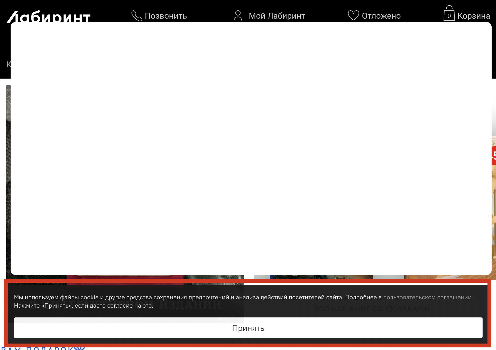
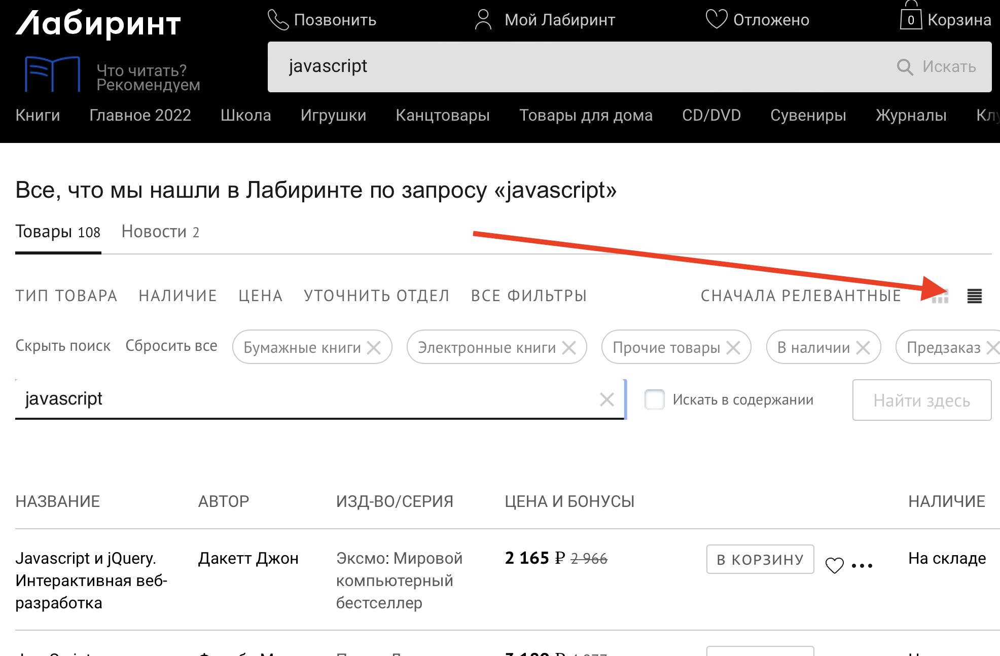
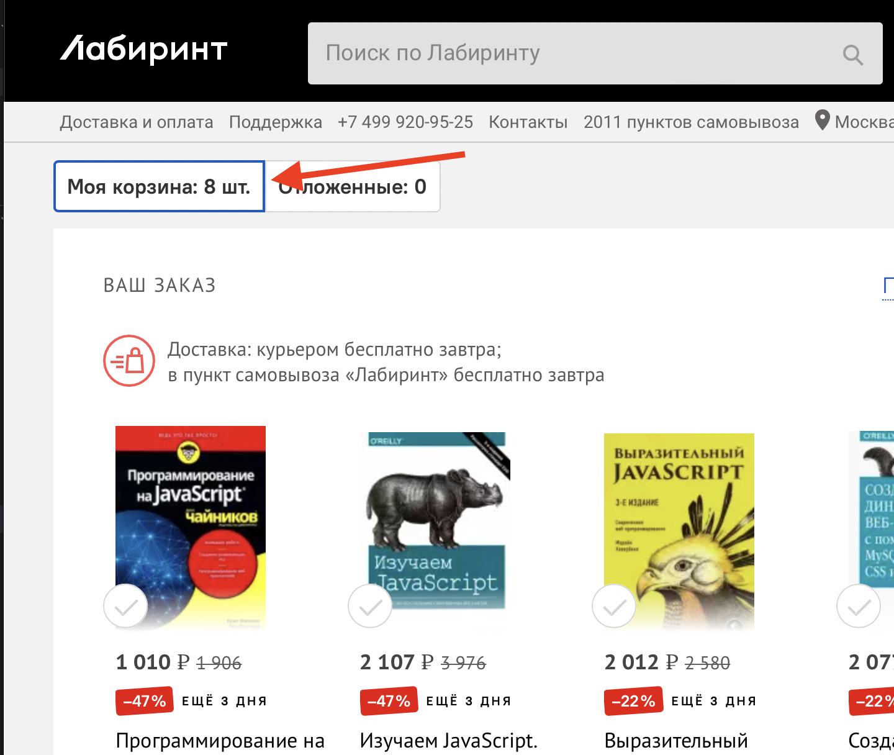

# Домашнее задание по курсу Автоматизация тестирования (4)

## Важно: У вас должен быть установлен [NodeJS](https://nodejs.org/ru/)

### Старт проекта:
1. Создайте новый проект (`npm init`)
2. Добавьте в проект зависимость 
   1. [selenium-webdriver](https://www.npmjs.com/package/selenium-webdriver)
   2. Остальные зависимости на ваше усмотрение

### Задание: 
1. Создайте файл `src/index.js`
2. Объявите в нем метод `labirint()`
3. В методе `labirint()` выполните шаги:
   1. Перейдите по адресу `https://www.labirint.ru`
   2. Внизу страницы плашка с сообщением о cookie. Нажмите `Принять`
   
   3. В поисковую строку (на верху страницы) введите текст `javascript` и выполните поиск
   
   4. Дождитесь страницу с выдачей результатов
   5. Переключите режим отображения на Табличный
   
   1. Для каждой книги в таблице нажмите кнопку `В корзину`
   2. Посчитайте, сколько вы добавили книг (пусть будет x)
   3. Перейите в корзину
   4.  Прочитайте текст на табе в корзине
    
   5.  Напечатайте в консоль, содержит ли текст таба число Х (true/false) 
4. Запустите скрипт `node src\index.js`

### Формат ответа:
1. Удалите папку node_modules
2. Создайте архив с папкой всего проекта
3. Полученный архив отправьте на проверку
